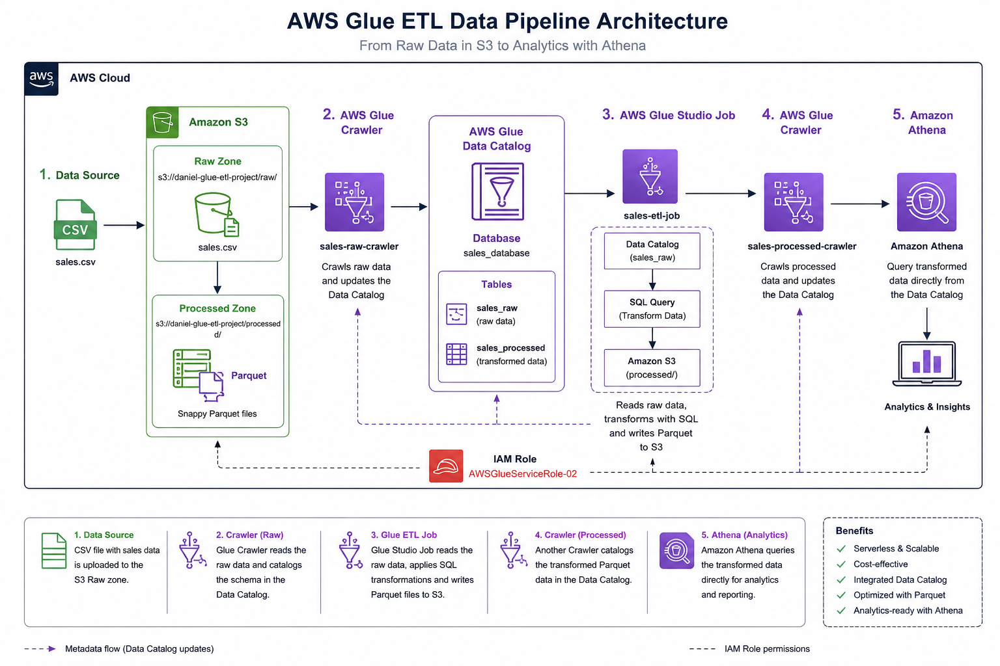

# AWS Glue ETL Sales Project

## Overview

This project demonstrates a simple ETL (Extract, Transform, Load) pipeline built on AWS using serverless services. The pipeline ingests raw sales data from Amazon S3, catalogs it with AWS Glue Crawlers, transforms the data using AWS Glue Studio, stores it in Parquet format, and queries it using Amazon Athena.

---

## Architecture



---

## AWS Services Used

- Amazon S3
- AWS Glue Data Catalog
- AWS Glue Crawlers
- AWS Glue Studio
- Amazon Athena
- AWS IAM

---

## Project Architecture

```text
CSV File
   │
   ▼
Amazon S3 (raw)
   │
   ▼
AWS Glue Crawler
   │
   ▼
Glue Data Catalog
   │
   ▼
Glue Studio ETL
(SQL Transformation)
   │
   ▼
Amazon S3 (processed - Parquet)
   │
   ▼
AWS Glue Crawler
   │
   ▼
Amazon Athena
```

---

## Dataset

The dataset contains sample sales information.

Columns:

- order_id
- customer
- city
- product
- quantity
- price

The ETL process creates a new calculated column:

- total_sale = quantity × price

---

## ETL Transformation

The AWS Glue Studio SQL transformation calculates the total sales amount.

```sql
SELECT
    order_id,
    customer,
    city,
    product,
    quantity,
    price,
    quantity * price AS total_sale
FROM MyDataSource;
```

---

## Sample Athena Queries

View all records

```sql
SELECT *
FROM sales_processed;
```

Total sales by city

```sql
SELECT
    city,
    SUM(total_sale) AS total_sales
FROM sales_processed
GROUP BY city
ORDER BY total_sales DESC;
```

Products sold

```sql
SELECT
    product,
    SUM(quantity) AS total_quantity
FROM sales_processed
GROUP BY product
ORDER BY total_quantity DESC;
```

---

## Skills Demonstrated

- Data Engineering Fundamentals
- ETL Pipeline Development
- AWS Glue Studio
- AWS Glue Crawlers
- AWS Glue Data Catalog
- SQL Transformations
- Amazon Athena
- Amazon S3
- IAM Permissions
- Parquet Data Format

---

## Repository Structure

```
aws-glue-etl-sales-project/

│── data/
│     sales_raw.csv

│── images/
│     architecture.png

│── queries.sql

│── README.md
```

---

## Results

✔ Raw CSV data successfully ingested into Amazon S3.

✔ Data cataloged using AWS Glue Crawlers.

✔ ETL pipeline created using AWS Glue Studio.

✔ CSV successfully converted into Parquet format.

✔ Data queried using Amazon Athena.

✔ IAM permissions configured for Glue ETL jobs.

---

## Author

Daniel Ruiz López

Bachelor's Degree in Information Technology Applied to Administration

AWS Data Engineer
